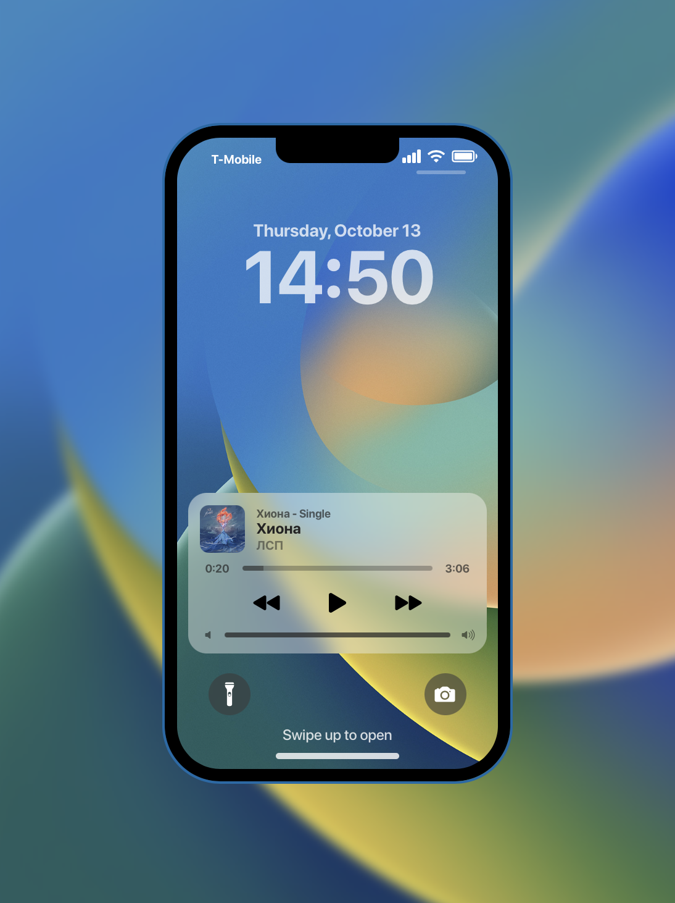
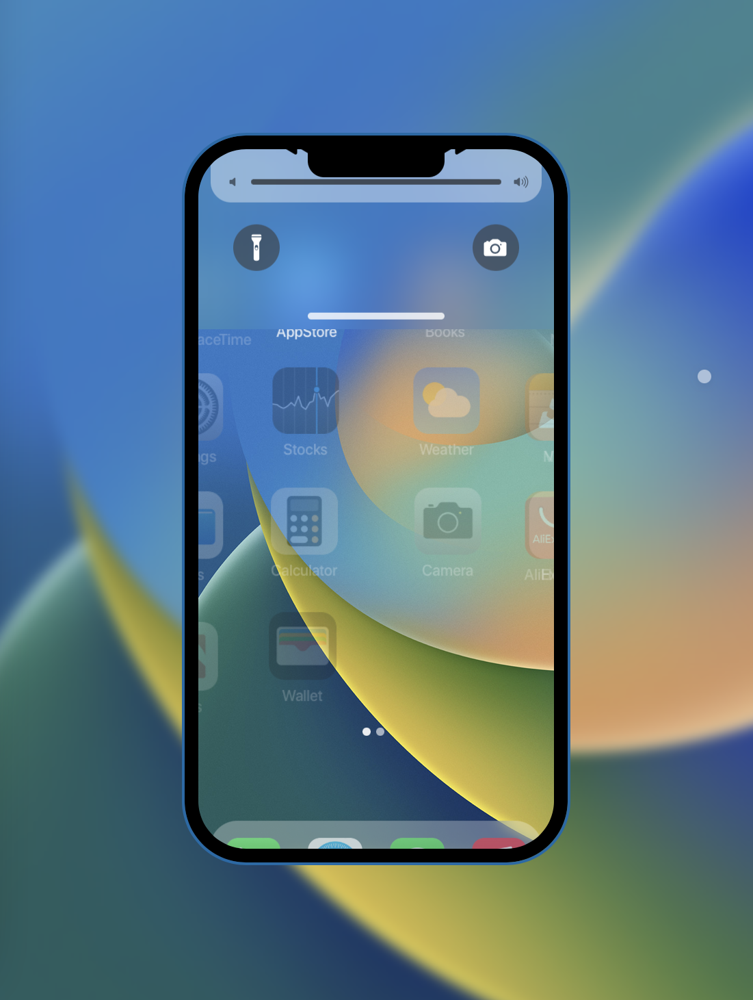
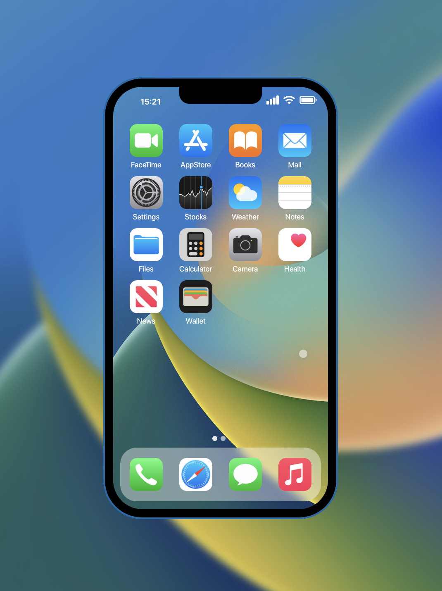
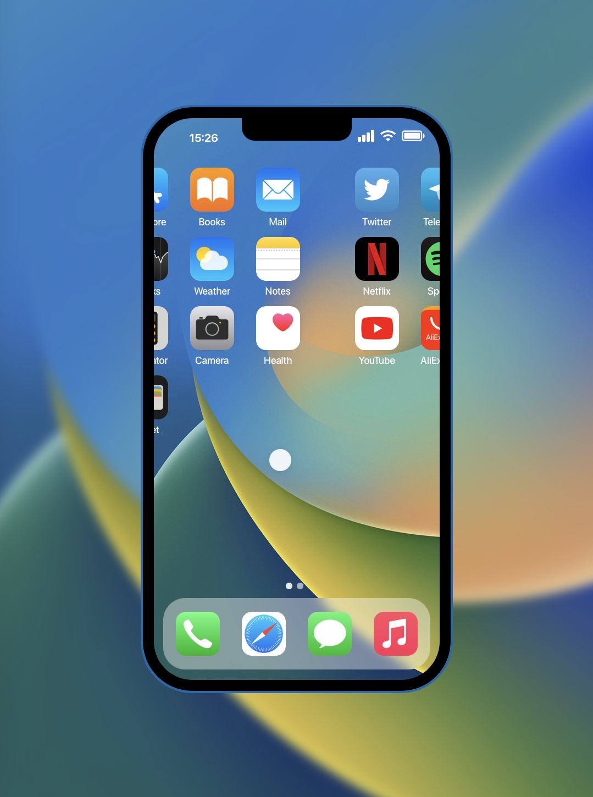

# iOS Interface Imitation 

### Written in React.js

This project was made for representing iOS interface replication possibility using JavaScript.

The end result is introduces below. 

[Test it yourself (Safari recommended)](https://msberyanov.github.io/ios-interface-imitation/)

Lockscreen:

Unlocking process:

Home Page:

Switching Home Pages:

